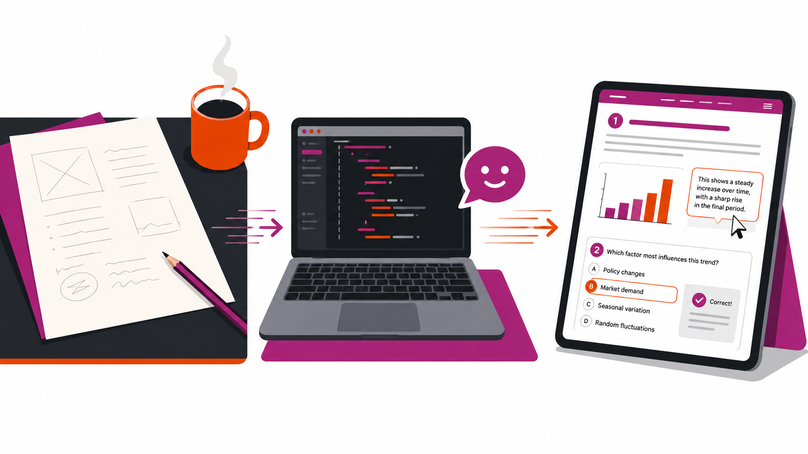
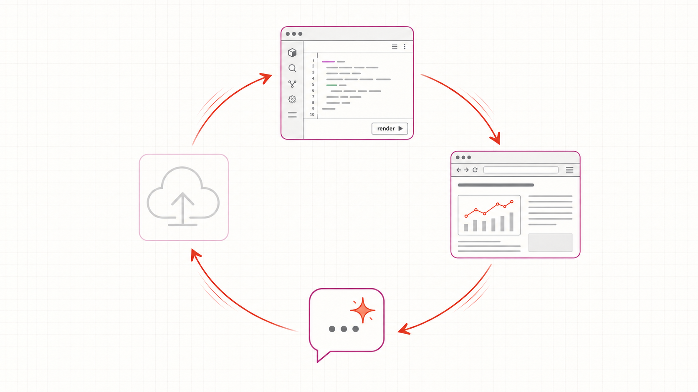

# Vorstellung & Motivation {background-color="#ffffff"}

::: {.columns}

::: {.column width="55%"}
::: incremental
- **Heute:** Sie bauen Ihr eigenes interaktives Skript — live im Netz
- **Wer ich bin:** Roman Bartnik, Prof. für Supply- und Projektmanagement, TH Köln
- **Warum jetzt:** Quarto + KI-Tutor → die Schwelle ist so niedrig wie nie
:::
:::

::: {.column width="45%"}
::: {.fragment}
{fig-align="center" width="95%"}
:::
:::

::::

::: notes
Hier zwei Minuten Spannungsaufbau: erst die Behauptung, dass *jeder* das schafft, dann die vier Vorbilder als Beweis. Die Vorbilder sind keine Mahnung, sondern Erlaubnis: das ist machbar, und morgen sieht Ihr Skript ähnlich aus. Beim letzten Punkt kurz darauf hinweisen, dass das eigene KI-als-Hilfe-Skript auch in einem solchen Workshop entstanden ist.
:::

# Vorstellungsrunde {background-color="#ffffff"}

::: {.columns}

::: {.column width="55%"}
**Pro Person 90 Sekunden, drei Punkte:**

::: incremental
- **Hochschule und Lehrgebiet** (wo, was unterrichten Sie?)
- **Was Sie heute mitbringen** (haben Sie Quarto / R / GitHub schon mal angefasst? Was nutzen Sie sonst zum Schreiben?)
- **Warum sind Sie hier?** (welches konkrete Skript haben Sie im Kopf — und was hindert Sie bisher?)
:::
:::

::: {.column width="45%"}
::: {.fragment}
{fig-align="center" width="95%"}
:::
:::

::::

::: notes
Reihenfolge im Uhrzeigersinn beginnen, mich selbst als erste*n. Bei jeder Person die dritte Antwort kurz spiegeln: „Ah, ein Skript zum Operations-Management — daran denken wir heute Nachmittag noch zurück." So entsteht im Raum eine Mini-Karte der Anwendungsfälle, die wir später beim Showcase wieder aufnehmen.
:::

# Drei Phasen heute {background-color="#ffffff"}

::: {.columns}

::: {.column width="55%"}
::: incremental
- **Phase 1 — Vormittag:** RStudio + KI-Tutor, alles lokal
- **Phase 2 — früher Nachmittag:** Zotero kommt dazu, immer noch lokal
- **Phase 3 — später Nachmittag:** GitHub Pages — live im Netz
:::
:::

::: {.column width="45%"}
::: {.fragment}
{fig-align="center" width="95%"}
:::
:::

::::

::: notes
Hier ist der entscheidende Architektur-Punkt: gestaffelte Werkzeug-Hinzunahme statt alles auf einmal. Das senkt die kognitive Last (Mayer 2021), ohne den Erfolgsmoment des „live im Netz" zu opfern — der kommt am Tagesende, nicht am Vormittag. Wer in Phase 1 hängt, kann trotzdem Phase 3 erleben.
:::

# Der Workflow {background-color="#ffffff"}

::: {.columns}

::: {.column width="55%"}
::: incremental
- **Schreiben** in RStudio (`.qmd`-Datei)
- **Rendern** mit `quarto render` oder Knopf
- **Ansehen** in der Browser-Vorschau auf `localhost`
- **Fragen** an den KI-Tutor im zweiten Tab
- **Veröffentlichen** in Phase 3 mit `Commit → Push`
:::
:::

::: {.column width="45%"}
::: {.fragment}
{fig-align="center" width="95%"}
:::
:::

::::

::: notes
Dies ist der Kreislauf, in den die Teilnehmenden den ganzen Tag eintauchen: Schreiben, Rendern, Ansehen, Fragen — und der Tag endet einmal mit Veröffentlichen. Wenn jemand morgen nur einen Satz vom Workshop mitnimmt, ist es dieser Vier-Schritt-Loop.
:::

# Los geht's {background-color="#c81e0f"}

::: {style="text-align:center; color: white; font-size: 2em; margin-top: 2em;"}
**Skript geöffnet?**

[https://th-koln-bartnik.github.io/Workshop-Interaktive-Skripte-Bartnik/](https://th-koln-bartnik.github.io/Workshop-Interaktive-Skripte-Bartnik/){style="color: white;"}
:::

::: notes
Letzte Folie: Nur die URL, weiße Schrift auf TH-Rot. Pause aushalten, bis alle die URL geöffnet haben — der Wechsel von Folien zu interaktivem Skript ist der eigentliche Workshop-Start.
:::

# Bild-Generierungs-Prompts {background-color="#ffffff"}

::: {style="font-size: 0.7em;"}

Diese Folie ist nicht Teil des Vortrags. Sie sammelt die vier Bild-Prompts zum späteren Generieren mit DALL·E, Midjourney, Imagen oder einem ähnlichen Werkzeug. Pro Folie ein Prompt; bei der Generierung Bilder als `images/intro-motivation.png`, `images/intro-vorstellungsrunde.png`, `images/intro-phasen.png`, `images/intro-workflow.png` ablegen.

## Folie 2 — Motivation (`intro-motivation.png`)

> A clean editorial vector illustration in three horizontal panels showing the metamorphosis of an academic teaching script. Left panel: a blank sheet of paper with faint pencil sketches and a coffee cup beside it. Center panel: an open laptop with a stylized code editor on screen and a small friendly chat bubble icon floating beside the laptop, suggesting an AI tutor companion. Right panel: a tablet held at a slight angle showing the same content transformed into a published web page with subtle interactive elements visible — a small bar chart, a quiz card, a hover tooltip. Color palette restricted to warm reds (#c81e0f), magenta (#b43092), orange accents (#ea5a00), with charcoal grays and paper-white background. Style: editorial illustration in the spirit of *The New York Times Sunday Review*, no photographic textures, no realistic faces. Subtle horizontal motion lines between the panels suggest progression from blank page to live publication. 16:9 aspect ratio, high contrast, suitable as keynote-slide background, transparent or white background.

## Folie 3 — Vorstellungsrunde (`intro-vorstellungsrunde.png`)

> A clean editorial vector illustration of a collegial round-table introduction at an academic workshop. Five abstract human figures sit around a circular wooden table, viewed from a slight elevated angle. The figures have no facial features — just silhouettes — but each is distinguished by a small accessory or prop: one with a coffee mug, one with an open notebook, one with a laptop, one with glasses on top of head, one with a backpack on the chair. Above each figure, a small thought bubble shows a stylized icon representing a different academic discipline: a beaker, a balance scale, a cogwheel, a line graph, an open book. Atmosphere is warm and collegial, suggesting curiosity and exchange rather than formality. Soft afternoon light, subtle wood-grain texture on the table surface. Color palette: warm reds (#c81e0f), magenta (#b43092), orange accents (#ea5a00), charcoal grays, on a paper-white background. Style: editorial, dignified, modern. 16:9 aspect ratio.

## Folie 4 — Drei Phasen (`intro-phasen.png`)

> A clean diagrammatic vector illustration showing three stacked horizontal bands that represent three phases of a workshop day. Top band: a single laptop with a stylized code editor open, plus a small chat bubble icon next to it (the AI tutor). Middle band: the same laptop, now connected by a thin curving line to a stack of books with a small library/citation icon (representing Zotero). Bottom band: the same scene, now extended with a globe icon and a small cloud, with a dotted line tracing from the laptop up to the cloud and out to the globe (representing publishing on the web). Each band has a very subtle background tint progressing through pale red, pale magenta, pale orange. No text inside the illustration — only icons. The composition reads top-to-bottom as growing scope without growing complexity. Color palette: warm reds (#c81e0f), magenta (#b43092), orange (#ea5a00), with neutral grays. Style: clean, modern, editorial-diagrammatic, inspired by information design principles à la Edward Tufte. 16:9 aspect ratio.

## Folie 5 — Workflow (`intro-workflow.png`)

> A clean technical vector illustration of a continuous four-node workflow loop arranged in a diamond pattern, connected by gracefully curving arrows showing circular flow. Top node: a stylized RStudio window with code visible and a small "render" button. Right node: a stylized browser window showing a rendered HTML page with a tiny chart inside. Bottom node: a small chat bubble icon with a subtle spark inside it, suggesting an intelligent AI tutor. Left node: a small upload-cloud icon (the publish step, slightly faded to suggest "later"). The arrows between nodes are gently animated-looking with subtle motion. The whole loop sits on a soft paper-white background with very faint grid lines, like graph paper. Color palette: warm reds (#c81e0f) for the main flow arrows, magenta (#b43092) for node borders, orange (#ea5a00) for the AI-tutor spark, charcoal grays for line weights and text. Style: clean, technical-illustrative, in the spirit of Tufte's information design — no decorative clutter, every element carries meaning. 16:9 aspect ratio, suitable as slide background.

:::

::: notes
Diese „Hidden Slide" für mich selbst — beim eigentlichen Vortrag mit „o" vom Folienlauf ausgeschlossen oder einfach nicht durchgeklickt. Nach dem Bildgenerieren die vier PNGs in `images/` ablegen, dann zeigen die Folien 2–5 oben die Bilder rechts neben den Bullets.
:::
